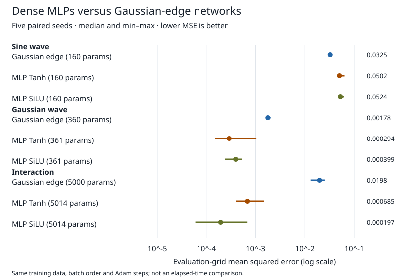

# KAN visualizer

I compare small PyTorch Gaussian edge networks with dense MLPs and show the exported networks' real activations in a browser. This builds on [Liu et al.'s KAN paper](https://arxiv.org/abs/2404.19756), but uses fixed Gaussian radial basis functions, not its B-splines.

**Question:** do learned edge functions fit these synthetic tasks better than an MLP with about the same number of parameters?

**Result:** across five paired seeds, both MLP baselines beat my Gaussian-edge networks on both two-dimensional tasks in every seed. The Gaussian-edge network wins the one-dimensional task in every seed. This is not a general KAN advantage: it is a small comparison at fixed Adam step budgets ([all results and settings](results/mlp_comparison/summary.json)).



[Live demo](https://mottopanikeiku.github.io/kan-visualizer/)

## Comparison

These are regression tasks, so I report mean squared error (MSE), not classification accuracy. Lower is better. Values below are median **[minimum, maximum]** on separate fixed evaluation grids ([summary](results/mlp_comparison/summary.json), [raw per-seed files](results/mlp_comparison/)).

| Target | Gaussian edge | MLP Tanh | MLP SiLU |
| --- | ---: | ---: | ---: |
| `sin(3x) + 0.3 cos(10x)` | 0.03247 [0.03041, 0.03308] | 0.05018 [0.04713, 0.06348] | 0.05237 [0.04959, 0.06135] |
| `sin(x) exp(-y²)` | 0.001780 [0.001663, 0.002024] | 0.0002936 [0.0001530, 0.001038] | 0.0003988 [0.0002399, 0.0005287] |
| `sin(xy) + 0.5 tanh(x-y)` | 0.01982 [0.01307, 0.02522] | 0.0006851 [0.0004045, 0.001479] | 0.0001967 [0.00005966, 0.0006833] |

| Task | Gaussian / MLP parameters | Adam steps per model |
| --- | ---: | ---: |
| Sine wave | 160 / 160 | 1,600 |
| Gaussian wave | 360 / 361 | 1,800 |
| Interaction | 5,000 / 5,014 | 3,200 |

[compare_mlp.py](compare_mlp.py) pairs training inputs and minibatch order across all models in each seed. MLPs have the same hidden-layer depth, with widths chosen from parameter counts, including biases; matching differs by less than 0.3%. Both families use the demo's task-specific learning rate, batch size, and final step budget. I do not tune on the evaluation grid or select the best checkpoint. The summary covers 45 runs; raw files also report MAE and training error.

## What the demo shows

[kan_layer.py](kan_layer.py) learns Gaussian coefficients and a base activation on each edge. [export_for_web.py](export_for_web.py) exports all forward parameters; [model-forward.js](web/js/model-forward.js) evaluates them directly, rather than interpolating plotted curves.

I added a four-step guide: read the graph, inspect an edge, move an input, then inspect recorded training history. Keyboard-accessible selectors mirror graph clicks. Live inference shows actual node activations and signed edge contributions. Mobile layouts and reduced-motion controls keep the same information available.

[Python/Node checks](results/verification.json) test numerical agreement and learning. [Headless Chromium checks](results/browser_pages.json) cover every model and view at desktop and mobile widths, keyboard selection, activation labels, and reduced motion, without console or request errors. The bundled browser models remain the earlier single-seed exports, not cherry-picked comparison runs.

## Reproduce

Python 3.13, `uv`, Node, and a browser; CPU only, no paid compute. I used one CPU thread on an AMD Ryzen AI 5 PRO 340 ([environment](results/mlp_comparison/environment.json)). No training-speed claim is made. The demo loads pinned plotting libraries from public CDNs.

```bash
uv venv --python 3.13 && uv pip sync --index-strategy unsafe-best-match --python .venv/bin/python requirements.lock
for seed in 1729 1730 1731 1732 1733; do nice -n 19 env OMP_NUM_THREADS=1 OPENBLAS_NUM_THREADS=1 MKL_NUM_THREADS=1 .venv/bin/python compare_mlp.py --seed "$seed"; done && .venv/bin/python compare_mlp.py --summarize && .venv/bin/python test_kan.py
nice -n 19 .venv/bin/python -m http.server 8002 --bind 127.0.0.1 --directory web
```

Open `http://127.0.0.1:8002`. Viewing the committed exports needs no retraining.

## Limitations and prior work

- Small noiseless synthetic functions, five seeds, fixed optimizer settings; not real-data evidence.
- Fixed Gaussian centers; no grid adaptation, pruning, or symbolic extraction.
- The RBF branch clamps to `[-1, 1]` while inputs span `[-2, 2]`; the base branch does not clamp.
- Sampled edge RMS is not feature importance. Moving particles illustrate connectivity only.

[FastKAN](https://github.com/ZiyaoLi/fast-kan) explores Gaussian replacements; I do not reproduce its implementation or results. [Equations, comparison method, and deployment](docs/GUIDE.md). [MIT license](LICENSE).

Written with AI coding assistance.
